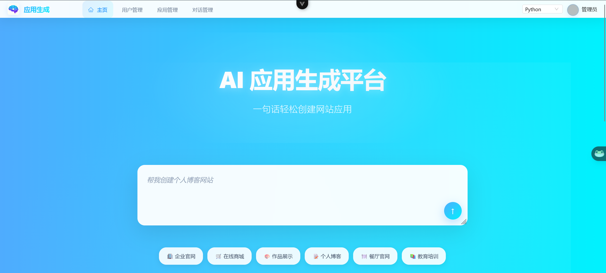
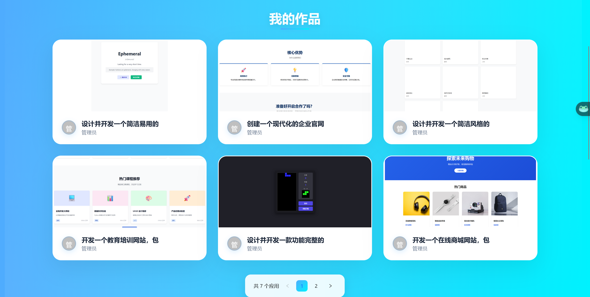
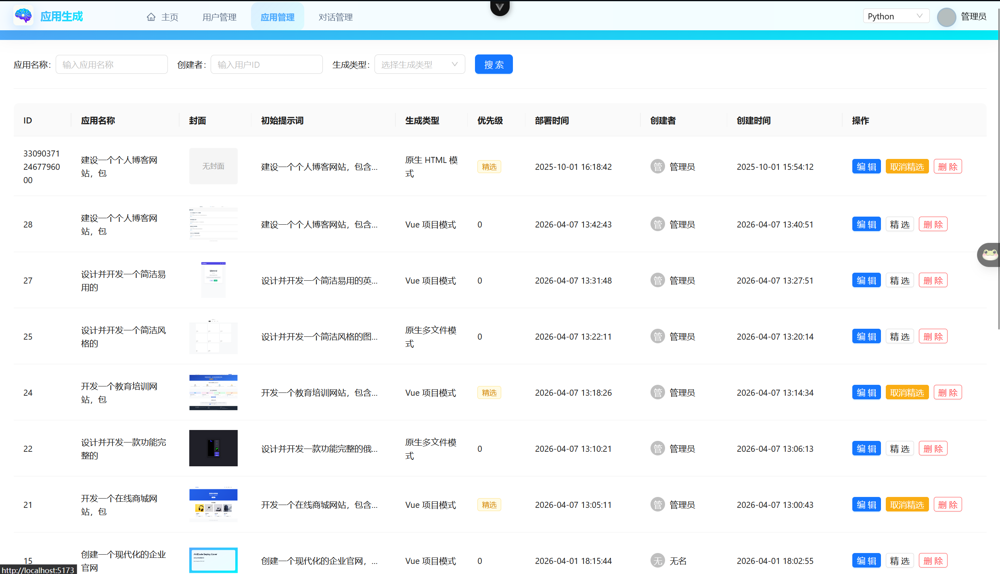
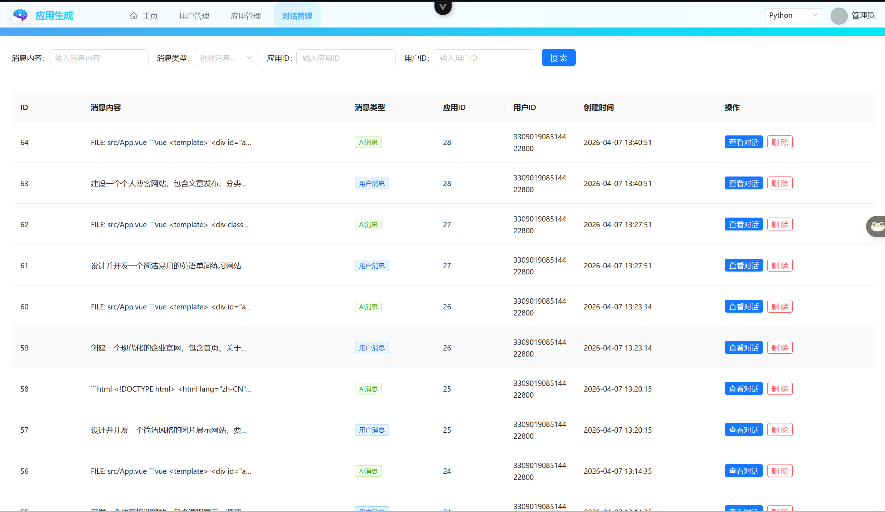

<div align="center">


# AI-ZCode

一个支持 **Java / Python 双后端切换** 的 AI 应用生成平台（PostgreSQL 版本）


[项目简介](#项目简介) • [功能预览](#功能预览) • [快速开始](#快速开始) • [项目结构](#项目结构) • [验证命令](#验证命令)

</div>

## 项目简介

AI-ZCode 是一个面向「自然语言生成网页 / 应用」场景的全栈项目。

它的核心特点不是只提供单一后端，而是：

- 同一套前端可在运行时切换 **Java Spring Boot** 与 **Python FastAPI** 两套后端
- 支持从提示词生成页面、预览、持续对话修改、下载代码、部署站点
- 支持用户体系、聊天历史、应用管理、后台管理、精选应用等完整业务链路

这让它非常适合做下面几类事情：

- 对比 Java / Python 两套后端的接口与能力表现
- 作为 AI 代码生成产品的实验平台
- 做本地开发、联调、回归测试和接口对齐

> [!TIP]
> 如果你只想尽快跑通主流程，推荐启动顺序为：`PostgreSQL / Redis` → `Python 或 Java 后端` → `ai-zcode-frontend`。

## 功能预览

### 首页





### 后台管理





## 核心能力

- **双后端切换**：同一前端可连接 Java / Python 两套服务
- **流式生成**：通过 SSE 持续输出 AI 生成内容
- **应用管理**：创建、编辑、删除、精选、后台分页管理
- **静态预览**：生成后可直接在前端 iframe 中预览页面
- **站点部署**：支持将生成结果部署为静态站点
- **代码下载**：支持下载生成代码包
- **聊天历史**：保留应用级生成对话历史
- **后端对齐**：Python 后端持续对齐 Java 主业务链路

## 技术栈

| 层级 | 技术 |
| --- | --- |
| 前端 | Vue 3、TypeScript、Vite、Pinia、Vue Router、Ant Design Vue |
| Java 后端 | Spring Boot 3.5.x、Java 21、MyBatis-Flex、LangChain4j、LangGraph4j |
| Python 后端 | FastAPI、SQLAlchemy 2、Alembic、LangChain、uv、Uvicorn |
| AI 能力 | OpenAI 兼容模型、DashScope、多模型路由、流式输出 |
| 数据与缓存 | PostgreSQL、Redis、Caffeine |
| 预览与部署 | Vite、Nginx、本地静态资源托管 |

## 项目结构

```text
ai-zcode - pg/
├── ai-zcode-frontend/              # Vue 3 前端
├── python-backend/                 # FastAPI 后端
├── src/main/java/com/aizcode/      # Spring Boot 后端
├── src/main/resources/             # Java 配置文件
├── sql/                            # PostgreSQL 建表与迁移脚本
├── docs/                           # 补充文档
├── pic/                            # README 配图
├── pom.xml                         # Java 构建配置
└── README.md
```

## 运行架构

### 前端

- 目录：`ai-zcode-frontend`
- 默认开发地址：`http://localhost:5173/`
- 支持切换目标后端：
  - Java：`/api`
  - Python：`/py-api`

### Java 后端

- 入口：`src/main/java/com/aizcode/AiZcodeApplication.java`
- 默认地址：`http://localhost:8234/api`
- 保留原有主业务实现与文档能力

### Python 后端

- 入口：`python-backend/app/main.py`
- 默认地址：`http://localhost:8335/api`
- 持续对齐 Java 主链路接口
- 支持生成代码、构建 Vue 项目、预览、部署、截图等功能

## 前置依赖

启动前建议准备好以下环境：

- `JDK 21`
- `Node.js 20+`
- `npm`
- `Python 3.11+`
- `uv`
- `PostgreSQL`
- `Redis`

如果你要启用 Python 后端的真实截图能力，还需要：

- `Playwright`
- `Chromium`
- 腾讯云 COS 配置

## 快速开始

### 1. 初始化数据库

创建 PostgreSQL 数据库后，执行：

```sql
\i 'E:/java-project/ai-zcode - pg/sql/create_table_postgresql.sql'
```

如需参考迁移说明，可查看：

- `sql/MySQL_to_PostgreSQL_Migration_Guide.md`

### 2. 启动 Java 后端

在仓库根目录执行：

```powershell
./mvnw.cmd spring-boot:run
```

默认地址：

- API：`http://localhost:8234/api`
- 健康检查：`http://localhost:8234/api/health/`
- Knife4j：`http://localhost:8234/api/doc.html`

> [!CAUTION]
> 请务必将 Java 侧本地配置中的数据库、Redis、AI Key、对象存储凭据替换为你自己的值，不要直接使用示例敏感配置。

### 3. 启动 Python 后端

进入目录并准备环境变量：

```powershell
cd "python-backend"
Copy-Item .env.example .env
```

安装依赖并启动：

```powershell
uv venv .venv
uv sync --all-groups
uv run aizcode-dev
```

如果只想启动 API：

```powershell
uv run uvicorn app.main:app --host 127.0.0.1 --port 8335 --reload
```

默认地址：

- API：`http://localhost:8335/api`
- 健康检查：`http://localhost:8335/api/health/`
- OpenAPI：`http://localhost:8335/docs`

如果你使用 Python 后端的截图功能，还建议执行：

```powershell
uv run playwright install chromium
```

### 4. 启动前端

```powershell
cd "ai-zcode-frontend"
npm install
npm run dev
```

默认地址：

- 前端：`http://localhost:5173/`

推荐本地配置：

```bash
VITE_DEPLOY_DOMAIN=http://localhost
VITE_JAVA_API_BASE_URL=/api
VITE_PYTHON_API_BASE_URL=/py-api
VITE_DEFAULT_BACKEND=java
```

### 5. 体验主流程

完成启动后，可按顺序验证：

1. 注册并登录
2. 创建应用
3. 进入应用对话页发送提示词
4. 查看生成后的网页预览
5. 继续对话修改页面
6. 下载代码或部署站点
7. 切换前端后端，验证 Java / Python 两条链路

## 关键配置

### Java 端

- 主配置：`src/main/resources/application.yml`
- 本地补充：`src/main/resources/application-local.yml`

### Python 端

- 示例配置：`python-backend/.env.example`
- 常用项包括：
  - `AIZCODE_DATABASE_URL`
  - `AIZCODE_REDIS_URL`
  - `AIZCODE_OPENAI_API_KEY`
  - `AIZCODE_OPENAI_MODEL`
  - `AIZCODE_CODE_DEPLOY_HOST`
  - `AIZCODE_COS_SECRET_ID`
  - `AIZCODE_COS_SECRET_KEY`
  - `AIZCODE_COS_REGION`
  - `AIZCODE_COS_BUCKET`
  - `AIZCODE_COS_HOST`

### 前端

- 后端切换：`ai-zcode-frontend/src/config/backend.ts`
- 环境变量参考：`ai-zcode-frontend/src/config/env.example.ts`

## 常用地址

| 服务 | 地址 |
| --- | --- |
| 前端 | `http://localhost:5173/` |
| Java API | `http://localhost:8234/api` |
| Python API | `http://localhost:8335/api` |
| Java 健康检查 | `http://localhost:8234/api/health/` |
| Python 健康检查 | `http://localhost:8335/api/health/` |
| Java 文档 | `http://localhost:8234/api/doc.html` |
| Python 文档 | `http://localhost:8335/docs` |
| 部署站点 | `http://localhost/{deployKey}/` |

## 验证命令

如果你修改了代码，建议至少执行以下检查：

```powershell
# Java
./mvnw.cmd test

# Python
cd "python-backend"
.\.venv\Scripts\python.exe -m pytest app/tests -q

# Frontend
cd "..\ai-zcode-frontend"
npm run type-check
npm run build
```

## 参考文档

- `docs/capability-matrix.md`
- `python-backend/README.md`
- `sql/MySQL_to_PostgreSQL_Migration_Guide.md`
- `ai-zcode-frontend/src/config/backend.ts`

> [!NOTE]
> 当前仓库的一个重要目标，是让 Python 后端逐步对齐 Java 主链路接口与体验；因此如果你同时维护两套后端，建议优先关注接口一致性、预览链路、部署链路与后台管理链路。
